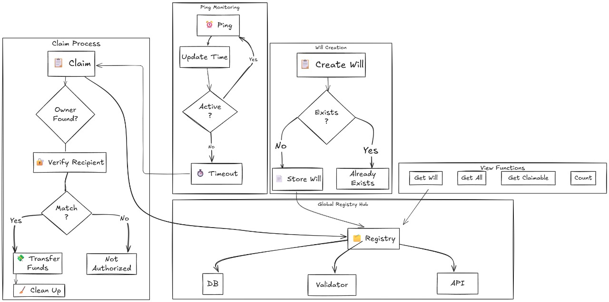
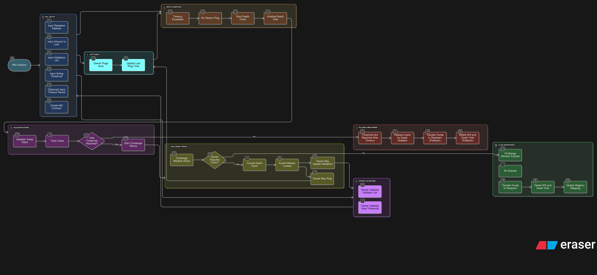

# ChainZap: Plan Your Legacy On-Chain

> **Losing our seed phrases or losing accounts sucks, but what if I told you that you can now plan your legacy on-chain?**

Welcome to **ChainZap** – a decentralized, trustless solution for planning your digital legacy on the Aptos blockchain.

Let me ask you a question:  
**What happens to your digital assets if something unexpected happens to you?**  
In the world of crypto, losing access to your wallet often means your assets are lost forever. There's no customer support, no recovery, and no way for your loved ones to inherit what you've built. That's a problem – and it's one we're here to solve.

---

## contract address

https://explorer.aptoslabs.com/txn/0x9d404816a2803cbc5c86c729412d9de05629f8a7e21835c9cc235fc7a60ecd0d?network=testnet

---

## Why do you need ChainZap?

Because your digital assets matter. You've worked hard to accumulate them, and you deserve the peace of mind that comes from knowing your legacy is protected. ChainZap lets you:

- Securely deposit APT tokens into a smart contract "will"
- Designate a recipient who can claim your assets if you become inactive
- Stay in control: only you can update your will or change the recipient
- Prove your activity by periodically "pinging" the contract
- If you don't ping within your chosen timeout, your recipient can claim the assets
- All actions are transparent, automated, and require no third party

---

## How does it work?



1. **Set Up & Fund Your Will**: Specify a recipient and amount. Funds are locked in the contract, secured by Aptos.
2. **Stay Active with Pings**: Regularly ping the contract to show you're still around. If you don't, your will becomes claimable.
3. **Claim by Recipient**: If the timeout passes, your recipient can claim the assets, all on-chain, with full auditability.

---

## Why did we build ChainZap on Aptos?

Aptos is one of the fastest, most secure, and most scalable blockchains available today. Its Move smart contract language is designed for safety and flexibility, making it the perfect foundation for a solution that demands trustlessness and reliability. With low fees, high throughput, and a vibrant ecosystem, Aptos ensures that your legacy is protected not just today, but for years to come.

---

## Why ChainZap?

- No lawyers, no paperwork, no centralized risks
- Your legacy, your rules, enforced by code
- Modern UI, wallet integration, and real-time updates

**Don't let your digital assets be lost forever. Plan, protect, and pass on your legacy – seamlessly, on Aptos. With ChainZap, your future is in your hands, and your legacy is on-chain.**

---

## Table of Contents

- [ChainZap: Plan Your Legacy On-Chain](#chainzap-plan-your-legacy-on-chain)
  - [contract address](#contract-address)
  - [Why do you need ChainZap?](#why-do-you-need-chainzap)
  - [How does it work?](#how-does-it-work)
  - [Why did we build ChainZap on Aptos?](#why-did-we-build-chainzap-on-aptos)
  - [Why ChainZap?](#why-chainzap)
  - [Table of Contents](#table-of-contents)
  - [Current Architecture \& Features](#current-architecture--features)
    - [Architecture Overview](#architecture-overview)
    - [Tech Stack](#tech-stack)
    - [Features](#features)
  - [User Flows](#user-flows)
    - [1. Will Creation](#1-will-creation)
    - [2. Ping](#2-ping)
    - [3. Claim](#3-claim)
  - [Smart Contract API Reference](#smart-contract-api-reference)
    - [Entry Functions](#entry-functions)
    - [View Functions](#view-functions)
  - [Environment Variables](#environment-variables)
  - [Setup \& Deployment](#setup--deployment)
    - [Prerequisites](#prerequisites)
    - [Installation](#installation)
    - [Running the App](#running-the-app)
    - [Deploying the Move Contract](#deploying-the-move-contract)
  - [Usage](#usage)
  - [Future Protocol: TLD (Trustless Legacy Distribution)](#future-protocol-tld-trustless-legacy-distribution)
    - [Planned Features](#planned-features)
  - [Developer Contact Info](#developer-contact-info)
  - [**Ready to plan your legacy? Try ChainZap today, and stay tuned for the next evolution of trustless digital inheritance!**](#ready-to-plan-your-legacy-try-chainzap-today-and-stay-tuned-for-the-next-evolution-of-trustless-digital-inheritance)
  - [Troubleshooting \& FAQ](#troubleshooting--faq)

---

## Current Architecture & Features

### Architecture Overview

- **Frontend:** Next.js app with wallet integration
- **Smart Contract:** Move contract on Aptos
- **Key Flows:** Will creation, ping, claim

### Tech Stack

- Next.js (React)
- TypeScript
- Tailwind CSS
- shadcn/ui
- Move (Aptos blockchain)
- Node.js

### Features

- Create a digital will and lock APT tokens
- Designate a recipient
- Ping to prove activity
- Recipient can claim if owner is inactive
- All actions are on-chain, transparent, and automated

---

## User Flows

### 1. Will Creation

- Connect wallet
- Enter recipient and amount
- Confirm and sign transaction
- Funds are locked in the contract

### 2. Ping

- Visit dashboard and click "Ping"
- Updates last activity timestamp

### 3. Claim

- Recipient connects wallet
- If timeout passed, can claim assets

---

## Smart Contract API Reference

### Entry Functions

- **initialize_global_registry(account: &signer)**
  - Initializes the global registry. Should be called once by deployer.
  - Errors: Already exists.

- **initialize(account: &signer)**
  - Initializes will state for the user.
  - Errors: Already exists.

- **create_will(account: &signer, recipient: address, amount: u64, registry_addr: address)**
  - Creates a new will, locks funds, and registers recipient.
  - Errors: Already exists, registry not initialized.

- **ping(account: &signer)**
  - Updates last activity timestamp for the will.
  - Errors: Will not found.

- **claim(account: &signer, registry_addr: address, owner_index: u64)**
  - Recipient claims will from a specific owner (by index).
  - Errors: Not found, not recipient, too soon, registry not initialized.

- **claim_single(account: &signer, registry_addr: address)**
  - Recipient claims the first (and only) will for their address.

### View Functions

- **get_will(addr: address): Option<Will>**
  - Returns the will for a given address.

- **get_wills_for_recipient(recipient: address, registry_addr: address): vector<Will>**
  - Returns all wills for a recipient.

- **get_claimable_wills_for_recipient(recipient: address, registry_addr: address): vector<Will>**
  - Returns all claimable wills (timeout passed) for a recipient.

- **get_will_count_for_recipient(recipient: address, registry_addr: address): u64**
  - Returns the number of wills for a recipient.

---

## Environment Variables

| Variable                                  | Required | Description                                        | Example Value |
| ----------------------------------------- | -------- | -------------------------------------------------- | ------------- |
| NEXT_MODULE_PUBLISHER_ACCOUNT_ADDRESS     | Yes      | Aptos address to publish contract                  | 0xabc123...   |
| NEXT_MODULE_PUBLISHER_ACCOUNT_PRIVATE_KEY | Yes      | Private key for contract publisher                 | 0xabcdef...   |
| NEXT_PUBLIC_APP_NETWORK                   | Yes      | Aptos network (testnet, mainnet, devnet)           | testnet       |
| NEXT_PUBLIC_MODULE_ADDRESS                | Auto     | Published contract address (set by publish script) | 0xabc123...   |
| NEXT_PUBLIC_APTOS_API_KEY                 | Optional | API key for Aptos node (if required)               | your-api-key  |

**.env Example:**

```
NEXT_MODULE_PUBLISHER_ACCOUNT_ADDRESS=0xabc123...
NEXT_MODULE_PUBLISHER_ACCOUNT_PRIVATE_KEY=0xabcdef...
NEXT_PUBLIC_APP_NETWORK=testnet
```

---

## Setup & Deployment

### Prerequisites

- [Node.js](https://nodejs.org/) (v18+ recommended)
- [npm](https://www.npmjs.com/) or [yarn](https://yarnpkg.com/)
- [Aptos CLI](https://aptos.dev/cli-tools/aptos-cli-tool/) (for contract deployment)
- Aptos wallet (e.g., Petra, Martian)

### Installation

```bash
git clone https://github.com/yourusername/chainZap.git
cd chainZap
npm install
# or
yarn install
```

### Running the App

```bash
npm run dev
# or
yarn dev
```

App runs at [http://localhost:3000](http://localhost:3000).

### Deploying the Move Contract

1. **Compile:**
   ```bash
   npm run move:compile
   ```
2. **Publish:**
   - Set your Aptos account address and private key in `.env`.
   - Run:
     ```bash
     npm run move:publish
     ```
3. **Upgrade:**
   ```bash
   npm run move:upgrade
   ```
4. **Test:**
   ```bash
   npm run move:test
   ```

---

## Usage

- **Connect your Aptos wallet** using the wallet selector.
- **Create a will:**
  - Enter recipient address and amount.
  - Confirm and sign the transaction.
- **Ping your will:**
  - Keep your will active by pinging within the timeout period.
- **Claim a will:**
  - If you're a recipient and the owner is inactive, claim the assets directly from the dashboard.
- **View claimable wills:**
  - See all wills you can claim from the dashboard.

---

---

## Future Protocol: TLD (Trustless Legacy Distribution)

> **This is our vision for the next generation of ChainZap.**



### Planned Features

- Validator voting for death claims
- Challenge periods for disputes
- Fallback mechanisms (super validator)
- Customizable validator sets and thresholds
- On-chain dispute resolution
- More robust, decentralized, and trustless inheritance

**How will TLD improve ChainZap?**

- Removes single points of failure
- Adds community/validator-based checks
- Enables more complex inheritance logic
- Increases security and fairness for all users

---

## Developer Contact Info

For questions, support, or contributions, contact:

- Debanjan Mondal — debanjanmondalk2005@gmail.com — [GitHub](https://github.com/Debanjannnn)
- Kaushik Samadder — kaushiksamadder2003work@gmail.com — [GitHub](https://github.com/Kaushik2003)

---

## **Ready to plan your legacy? Try ChainZap today, and stay tuned for the next evolution of trustless digital inheritance!**

## Troubleshooting & FAQ

**Wallet not connecting?**

- Ensure you have an Aptos-compatible wallet installed (e.g., Petra, Martian).
- Refresh the page and reconnect.

**Contract errors (e.g., registry not initialized)?**

- Make sure to initialize the contract and global registry before creating wills.

**Claim fails with 'too soon'?**

- The owner must be inactive (not pinged) for the full timeout period before a claim is allowed.

**How do I update my will?**

- You can create a new will to overwrite the previous one.

**Where are my assets stored?**

- Assets are locked in the Move contract on Aptos until claimed.
